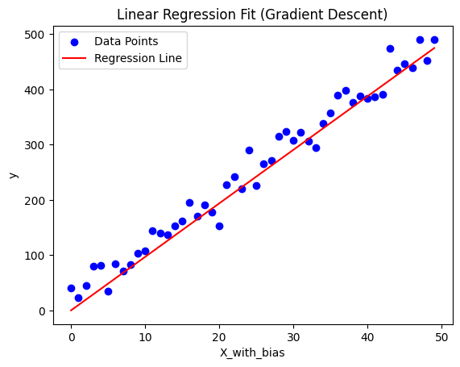
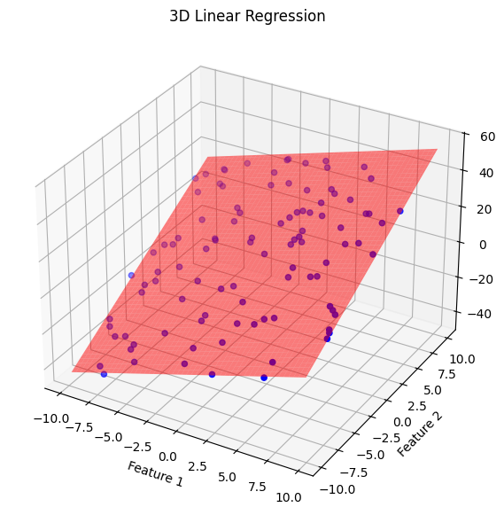
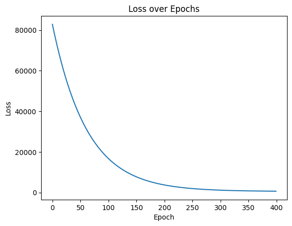
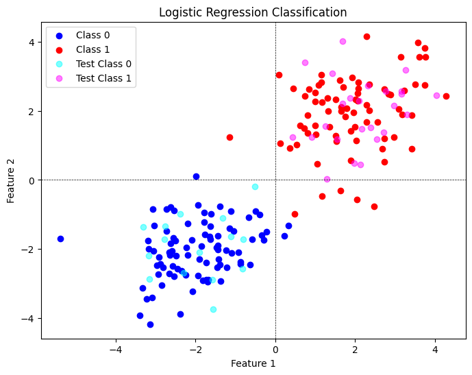
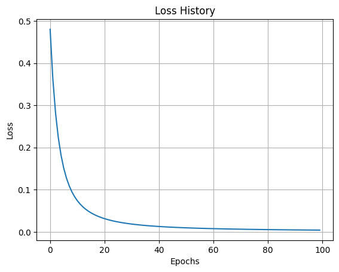

# ML From Scratch

Hands-on implementations of classic ML algorithms using math and numpy for studying.

## Overview

This repository contains educational implementations of machine learning algorithms built from first principles. Each algorithm is implemented using only numpy and basic mathematical operations to provide clear understanding of the underlying mechanics.

## Structure

```
mlfromsc/
├── algorithms/
└──   └── *           # the implemented algorithms

notebooks/
    └── *           # Interactive examples and explanations
```

## Implemented Algorithms

### Linear Regression

- **Ordinary Least Squares (OLS)**: Classic closed-form solution / statistical approach
- **Gradient Descent Implementation**

|  |  |  |
| :----------------------------------------------: | :----------------------------------------------: | :--------------------------------------------------------: |
|            _Linear Regression GD 2D_             |            _GLinear Regression GD 3D_            |             _Linear Regression Loss Exposure_              |

### Logistic Regression

- **Binary Classifier**: Implementation using the sigmoid function and maximum likelihood estimation
- **Gradient Descent Implementation**

|  |  |
| :---------------------------------------------------------------: | :-------------------------------------------------------: |
|            _Logistic Regression Decision Boundary 2D_             |             _Logistic Regression Loss Curve_              |

## Learning Approach

Each implementation focuses on:

- Mathematical clarity over performance optimization (otherwise just use scikit-learn lol)
- Step-by-step derivations in accompanying notebooks
- Minimal dependencies to understand core concepts
