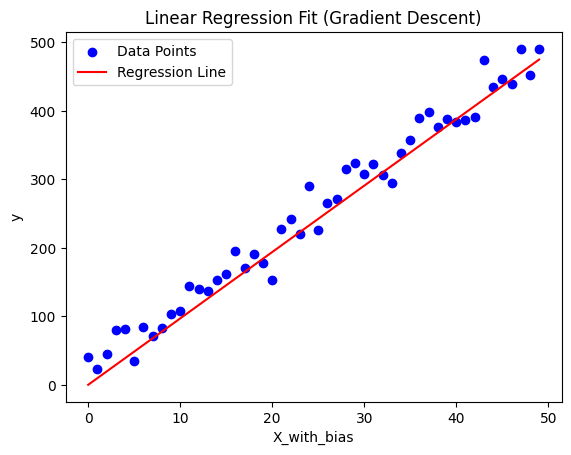
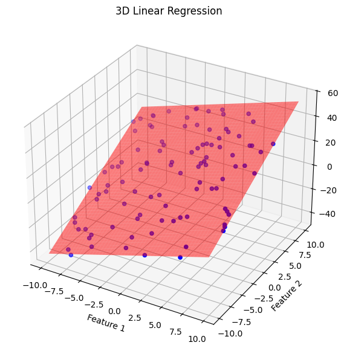
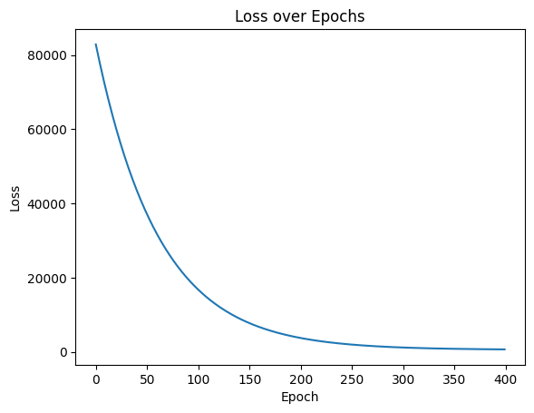
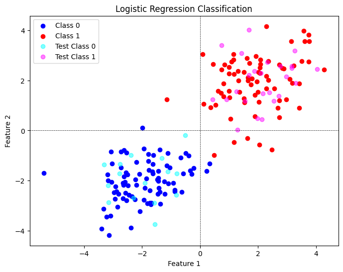
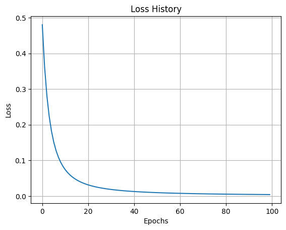
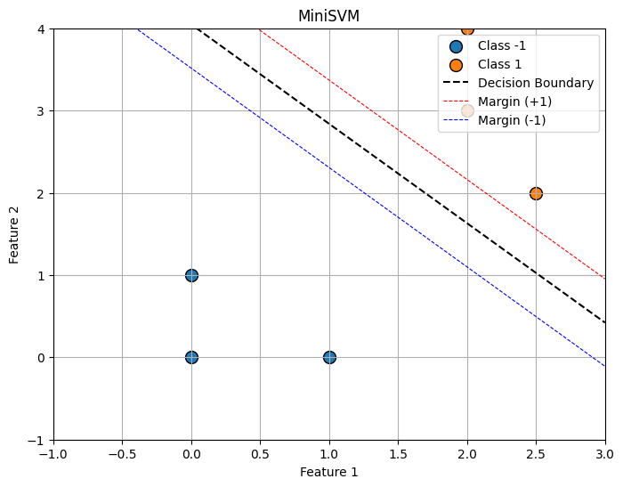
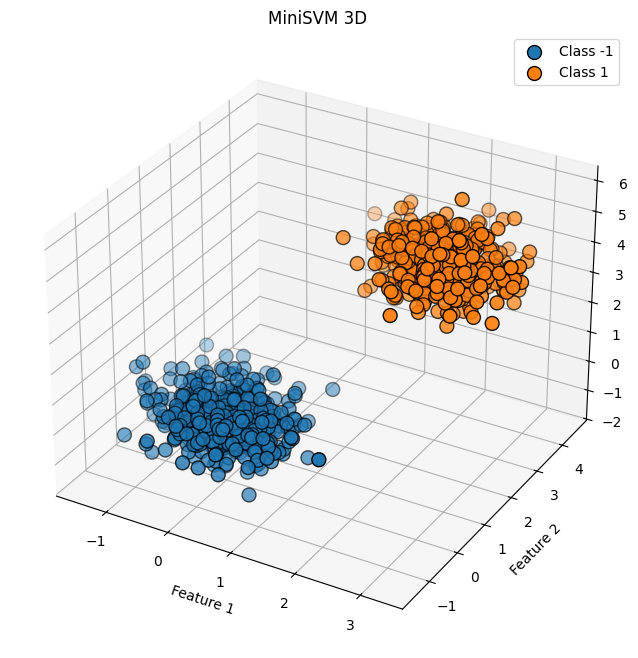
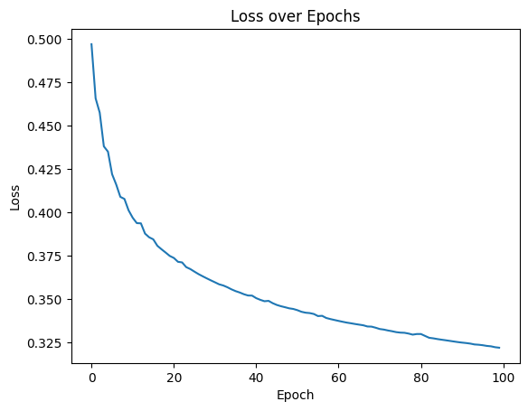
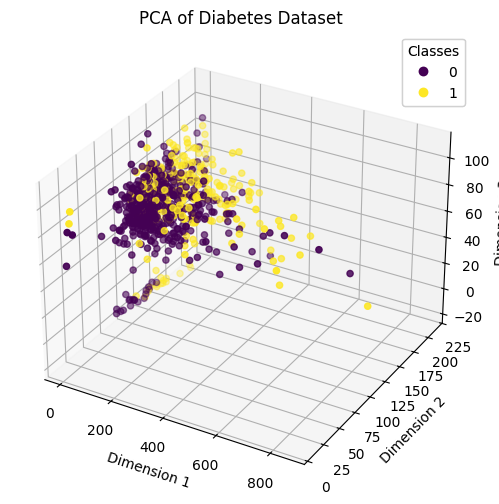
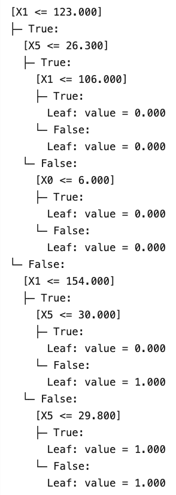

# ML From Scratch

Hands-on implementations of classic ML algorithms using math and numpy for studying.

## Overview

This repository contains educational implementations of machine learning algorithms built from first principles. Each algorithm is implemented using only numpy and basic mathematical operations to provide clear understanding of the underlying mechanics.

## Structure

```
mlfromsc/
├── algorithms/
└──   └── *           # the implemented algorithms

notebooks/
    └── *           # Interactive examples and explanations
```

## Implemented Algorithms

### Linear Regression

- **Ordinary Least Squares (OLS)**: Classic closed-form solution / statistical approach
- **Gradient Descent Implementation**

|  |  |  |
| :-----------------------------------------------: | :-----------------------------------------------: | :---------------------------------------------------------: |
|             _Linear Regression GD 2D_             |             _Linear Regression GD 3D_             |              _Linear Regression Loss Exposure_              |

### Logistic Regression

- **Binary Classifier**: Implementation using the sigmoid function and maximum likelihood estimation
- **Gradient Descent Implementation**

|  |  |
| :----------------------------------------------------------------: | :--------------------------------------------------------: |
|             _Logistic Regression Decision Boundary 2D_             |              _Logistic Regression Loss Curve_              |

### MiniSVM (Support Vector Machine)

- **Gradient Descent Implementation**
- It lacks _Kernel functions_ like RBF, Poly, Sigmoid... currently it's only linear

|  |  |  |
| :------------------------------------------------: | :------------------------------------------------: | :----------------------------------------------------------: |
|                   _MiniSV GD 2D_                   |                  _MiniSVM GD 3D_                   |                   _MiniSVM Loss Exposure_                    |

### PCA (Principal Component Analysis)

- Transforms n dimensional data onto a new coordinate system (dimension redcuction)

|  |
| :-----------------------------------------------------------: |
|             _PCA Example (Reduction of 9D to 3D)_             |

### Decision Tree

- Classifier using _Entropy_ to calculate information gain for splits
- Regressor using _MSE_ (Mean Squared Error) to calculate best split

|  |
| :---------------------------------------------------------: |
|              _Decision Tree Classifier Print_               |

_The Regressor currently does not have an example notebook :(_

### Random Forest

- RF Classifier using the above introduced Decision Tree Classifier
- RF Regressor using the above mentioned Decision Tree Regressor

Examples here:
[Random Forest Classifier Notebook](notebooks/04_random_forest_classifier.ipynb)
[Random Forest Regression Notebook](notebooks/04_random_forest_regression.ipynb)

## Learning Approach

Each implementation focuses on:

- Mathematical clarity over performance optimization (otherwise just use scikit-learn lol)
- Step-by-step derivations in accompanying notebooks
- Minimal dependencies to understand core concepts
